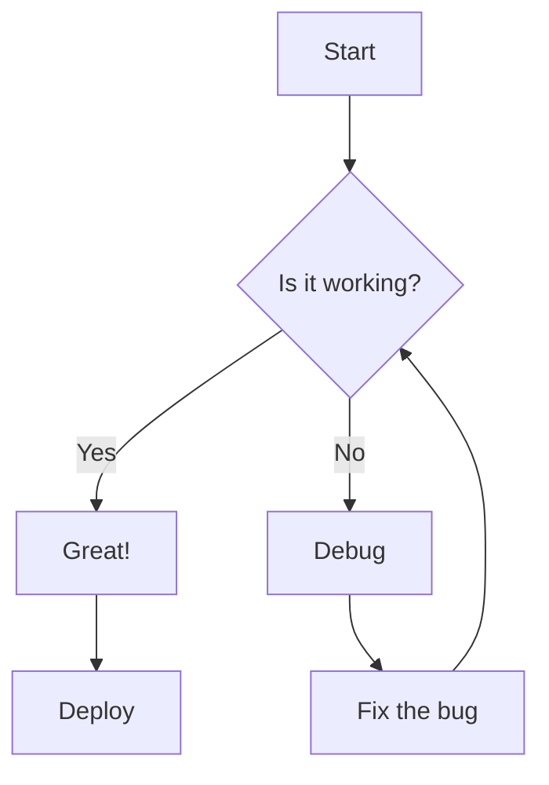
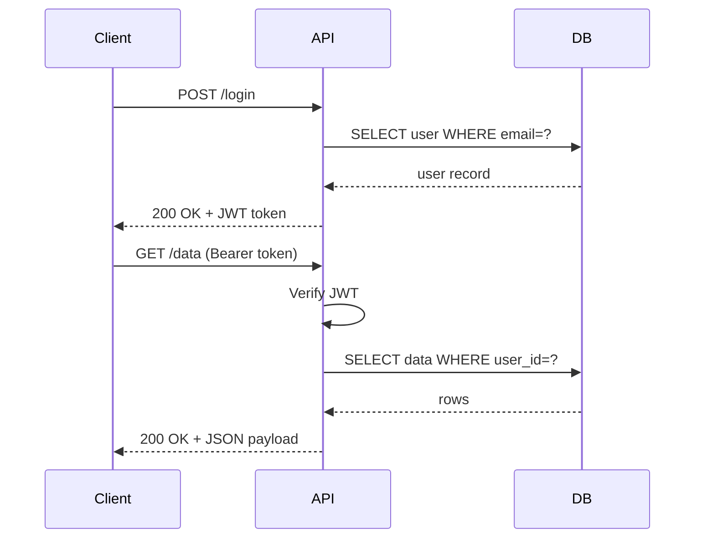
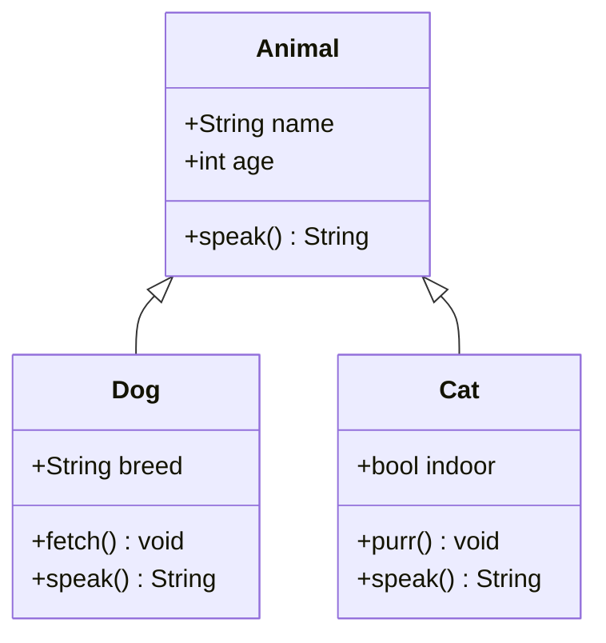
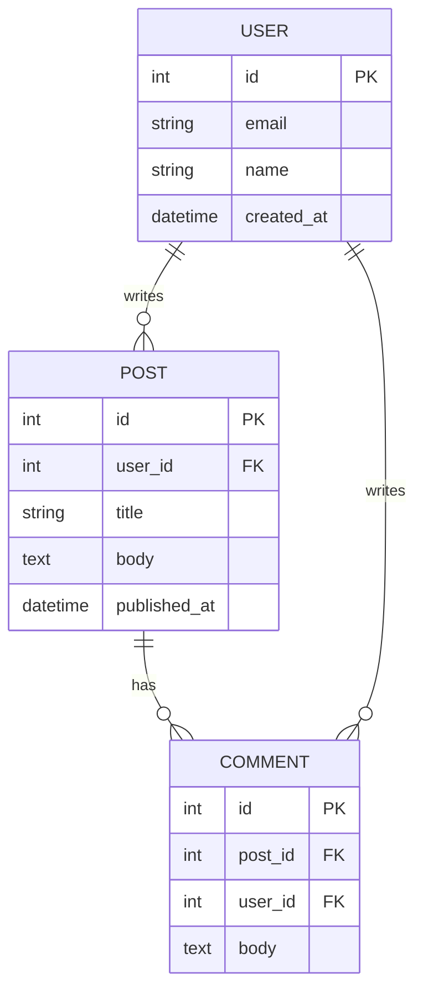
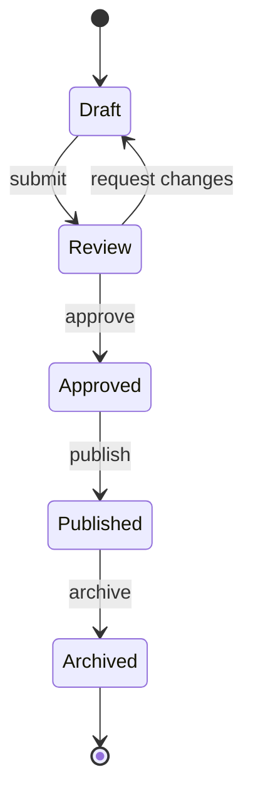

# Diagrams

This chapter demonstrates Mermaid diagram rendering across multiple diagram types.

## Flowchart



## Sequence Diagram



## Class Diagram



## Entity Relationship



## State Diagram



## Multi-line Labels and Quotes

Node labels can use `\n` for line breaks and escaped quotes for embedded
quotation marks — both are rewritten automatically so Mermaid renders them
correctly instead of showing literal backslashes:

```mermaid
flowchart TD
    A["Request received\nvalidated by middleware"] --> B{Cache hit?}
    B -->|Yes| C["Serve from cache"]
    B -->|No| D["Query source: \"users\" table"]
    D --> E["Response cached\nfor 60s"]
```